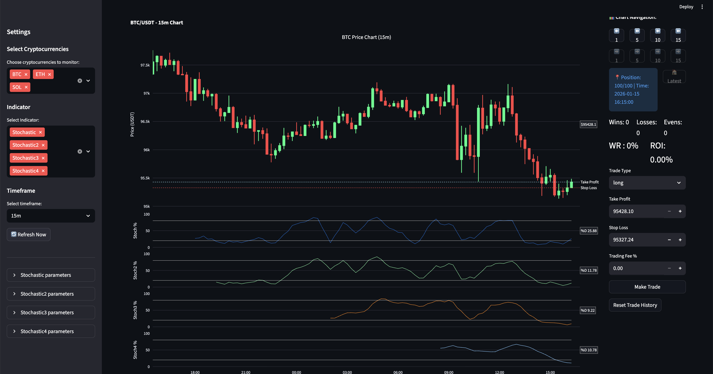
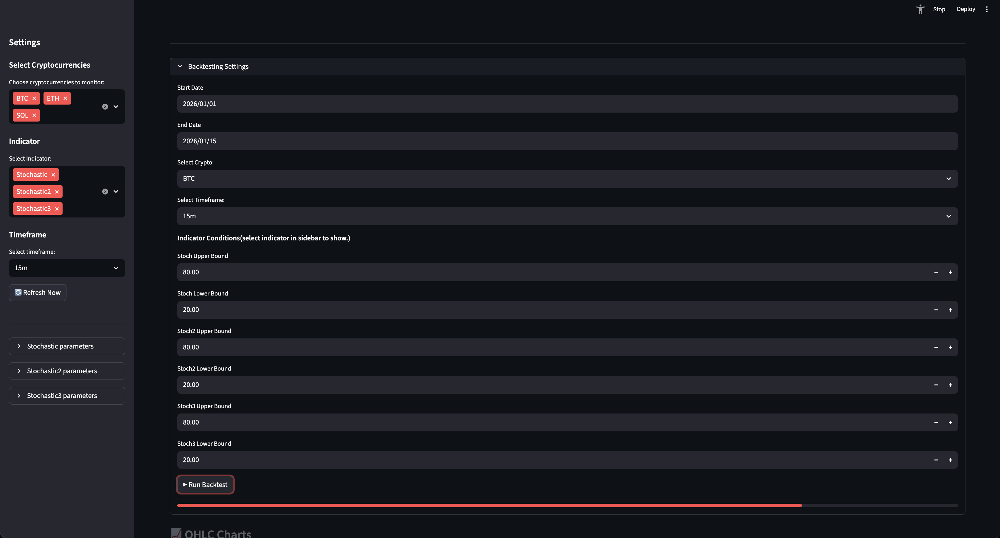
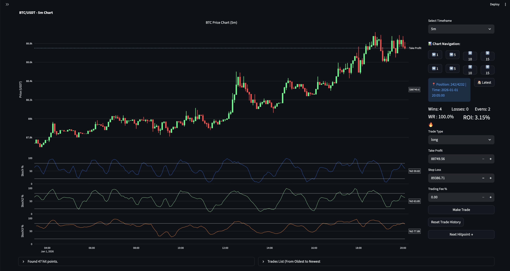

# Crypto Price Monitor

Interactive crypto charts, indicators, backtesting, and a lightweight trade simulator — built with Streamlit, Plotly, Pandas, and CCXT. Entry point is [main.py](main.py); the primary app logic lives in [app/crypto_monitor.py](app/crypto_monitor.py).

## Highlights ## 
- Multiple symbols and timeframes via sidebar
- Interactive OHLC charts with auto-pan and navigation
- Candlestick highlighting with star markers and approximate matching
- Configurable indicators (RSI, Bollinger Bands, Stochastic x4, KDJ, Williams %R, Half Trend)
- UI backtesting with timestamp hitpoints and “Next Hitpoint” navigation
- Simple trade simulator (long/short, SL/TP, fees, ROI tracking)

---

## Installation ##
- Python 3.10+ recommended; internet required for live data.

macOS/Linux
```bash
python -m venv .venv
source .venv/bin/activate
pip install -r requirements.txt
streamlit run main.py
```

Windows (Quick Start)
- Double-click [setup.bat](setup.bat) to create a venv and install deps
- Double-click [run_app.bat](run_app.bat) to start the app

If you prefer manual setup on Windows, use PowerShell:
```bash
python -m venv .venv
.venv\Scripts\Activate.ps1
pip install -r requirements.txt
streamlit run main.py
```

---

## Usage Overview ##
- Open the sidebar to:
   - Select cryptos (BTC, ETH, SOL by default)
   - Pick timeframes (1m, 3m, 5m, 15m, 1h, 4h, 1d)
   - Choose indicators and set parameters
   - Click “Refresh Now” to clear caches and reload
- Navigate charts using the button groups (Back/Forward 1/5/10/15, jump to Latest) ** 

**Little data will be visible by default. Begin backtesting for main program features.** 

---

### Backtesting ###
- Open the “Backtesting Settings” expander in the main view:
   - Choose a crypto, timeframe, and date range
   - Configure indicator conditions (e.g., RSI bounds, Stochastic levels, BB touches, KDJ intersection, Half Trend signal)
   - Click “Run Backtest”
- Outputs:
   - Saves per-timeframe OHLC to [data/…_df.csv](data) for fast switching (e.g., 5m, 15m, 1h, 4h, 1d)
   - Writes computed series to [data/backtest.csv](data/backtest.csv)
   - Writes hit timestamps to [data/filtered_backtest.csv](data/filtered_backtest.csv)
- While viewing a backtest:
   - Use “Next Hitpoint →” to jump to the next hit
   - Click timestamps under the expander to jump directly
   - Chart auto-pans to the latest nav/hit/highlight; higher-timeframe transitions render a “ghost” candle from lower TF context to avoid spoilers

---

### Trade Simulator ###
- Available on chart views; shows SL/TP lines and auto-stops when hit after the next candle.
- Tracks wins/losses/evens, compound ROI%, and stores history in [data/trading_history.csv](data/trading_history.csv).

---

### Dashboard Gallery
**Starting Page**

**Backtest Settings**

**Live Trading with Portfolio Tracking**



**Configuration**
- Edit [app/config.py](app/config.py) to customize:
   - AVAILABLE_CRYPTOS: symbol → market (e.g., BTC → BTC/USDT)
   - DEFAULT_INDICATORS and indicator availability
   - TIMEFRAMES and chart window size
   - Cache TTLs and API rate limit
   - Colors and UI stability

Example: Add a new symbol
```python
AVAILABLE_CRYPTOS = {
   'BTC': 'BTC/USDT',
   'ETH': 'ETH/USDT',
   'SOL': 'SOL/USDT',
   'ADA': 'ADA/USDT',  # new
}
```

---

**Indicators**
- RSI ([app/indicators/rsi.py](app/indicators/rsi.py))
- Bollinger Bands ([app/indicators/bollinger_bands.py](app/indicators/bollinger_bands.py))
- Stochastic variants x4 ([app/indicators/stochastic.py](app/indicators/stochastic.py))
- KDJ ([app/indicators/kdj.py](app/indicators/kdj.py))
- Williams %R ([app/indicators/williams_r.py](app/indicators/williams_r.py))
- Half Trend ([app/indicators/half_trend.py](app/indicators/half_trend.py))

Indicators that don’t overlay price are rendered on separate axes (see `SEPARATE_AX_INDICATORS` in [app/config.py](app/config.py)).

---

**Data Source & Caching**
- Exchange: Binance via CCXT ([api/binance/data_fetcher.py](api/binance/data_fetcher.py))
- Live OHLC and current price with Streamlit `@st.cache_data` for responsiveness
- Local timezone conversion applied to timestamps
- API rate limits configurable (see `RATE_LIMIT`, `ENABLE_RATE_LIMIT` in [app/config.py](app/config.py))

---

**Project Structure (Key Files)**
- [main.py](main.py): app entry (launches `CryptoMonitor`)
- [app/crypto_monitor.py](app/crypto_monitor.py): page config, layout, component wiring
- [app/sidebar/sidebar.py](app/sidebar/sidebar.py): user controls (symbols, timeframes, indicators, params)
- [app/charts/ohlc_chart.py](app/charts/ohlc_chart.py): chart creation, auto-pan, overlays
- [app/charts/chart_navigation.py](app/charts/chart_navigation.py): Back/Forward/Latest navigation logic
- [app/charts/candlestick_highlighter.py](app/charts/candlestick_highlighter.py): date/time highlight UI and markers
- [app/backtest/backtest_settings.py](app/backtest/backtest_settings.py) & [app/backtest/backtester.py](app/backtest/backtester.py): UI configuration and hitpoint detection
- [app/trade_simulator.py](app/trade_simulator.py): SL/TP lines, auto-stop, ROI
- [api/binance/data_fetcher.py](api/binance/data_fetcher.py): CCXT integration and OHLC/current price
- [app/state_manager.py](app/state_manager.py): typed accessors for `st.session_state`

---

**Development & Testing**
- Quick API sanity check: run [test_app.py](test_app.py)
```bash
python test_app.py
```
- Debug UI for navigation concepts: [debug_nav.py](debug_nav.py)

---

**Troubleshooting**
- Port conflicts: Streamlit defaults to 8501; change with `--server.port`
- Empty charts: network issues or timeframe out of range; try “Refresh Now”
- CCXT errors: check internet and API limits; reduce refresh frequency
- Cache: clear via sidebar button or restart the app

---

**Notes**
- Requirements include `datetime`/`asyncio` which are part of Python’s stdlib; they don’t need separate installation.
- `python-binance` is listed but CCXT is used for data access.

---

**License**
- Internal/Project use. Add a license section if you plan to distribute.
- Mobile app version
